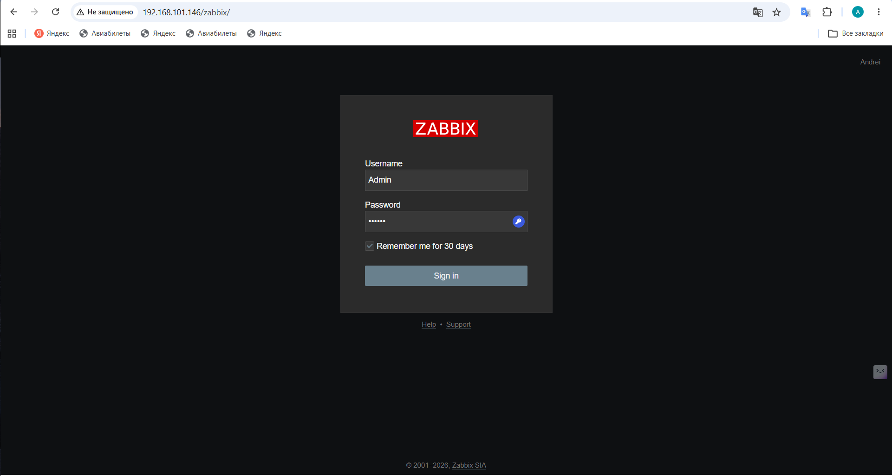
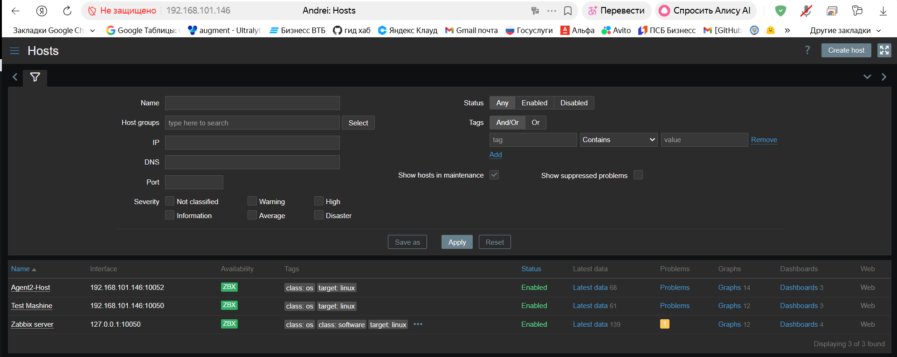
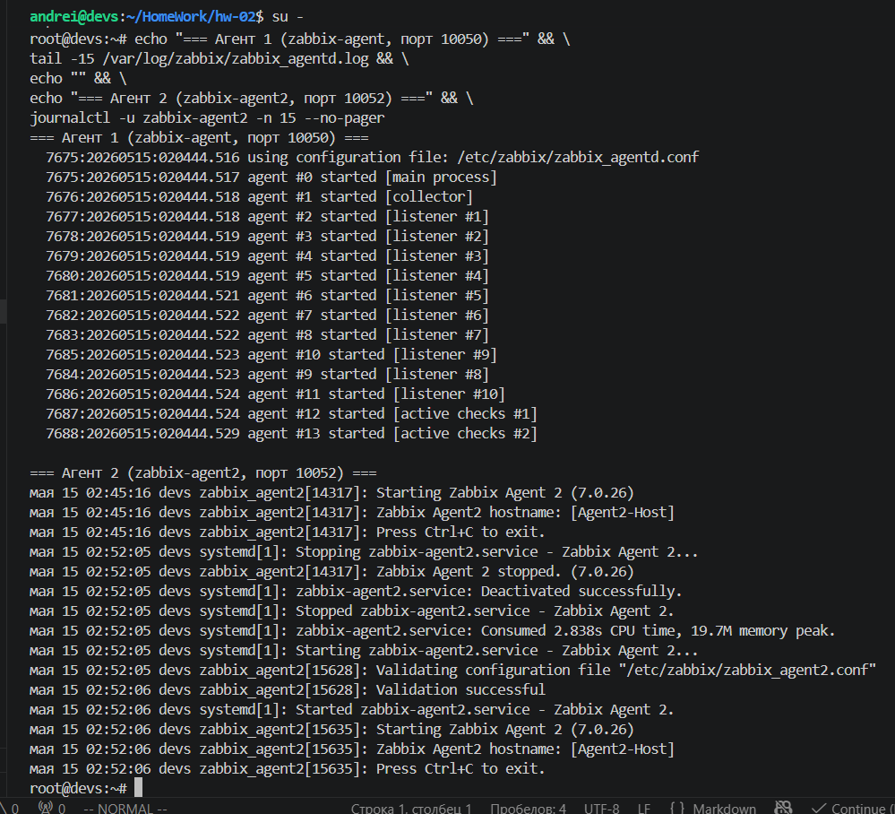
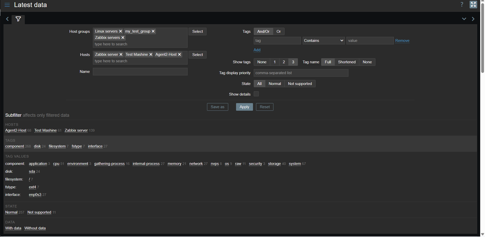

  Скриншоты не отображаются по двум причинам:

## Причина 1: Неправильный синтаксис в README.md

У вас написано просто текст:
```markdown
img/screenshot_login.png
```

А нужен Markdown-синтаксис для изображений:
```markdown

```

## Причина 2: Скриншоты не загружены в репозиторий

Давайте исправим обе проблемы:

### Шаг 1: Исправить README.md
## Проблема: неправильный путь + скриншоты не загружены

В README.md путь к скриншотам **без папки `img/`** + скриншоты ещё не загружены на GitHub.

Вот исправленный файл. Скопируйте и замените:

```bash
cat > ~/HomeWork/hw-02/README.md << 'EOF'
# Домашнее задание: Система мониторинга Zabbix

**Выполнил:** Andrei

---

## Задание 1. Установка Zabbix Server с веб-интерфейсом

### Использованные команды

```bash
# Установка репозитория Zabbix 7.0 для Debian 13 (Trixie)
wget https://repo.zabbix.com/zabbix/7.0/debian/pool/main/z/zabbix-release/zabbix-release_latest_7.0+debian13_all.deb
dpkg -i zabbix-release_latest_7.0+debian13_all.deb
apt update

# Установка Zabbix Server, Frontend, Agent
apt install zabbix-server-pgsql zabbix-frontend-php php8.4-pgsql \
  zabbix-apache-conf zabbix-sql-scripts zabbix-agent

# Создание базы данных PostgreSQL
su - postgres -c 'psql --command "CREATE USER zabbix WITH PASSWORD '\''123456789'\'';"'
su - postgres -c 'psql --command "CREATE DATABASE zabbix OWNER zabbix;"'

# Импорт схемы
zcat /usr/share/zabbix-sql-scripts/postgresql/server.sql.gz | \
  sudo -u zabbix psql zabbix

# Настройка пароля в конфиге
sed -i 's/# DBPassword=/DBPassword=123456789/g' /etc/zabbix/zabbix_server.conf

# Запуск служб
systemctl restart zabbix-server zabbix-agent apache2
systemctl enable zabbix-server zabbix-agent apache2
```

### Скриншот авторизации в админке


---

## Задание 2. Установка Zabbix Agent на два хоста

### Агент 1 (zabbix-agent)

```bash
systemctl status zabbix-agent
grep -E "^Server|^ServerActive|^Hostname" /etc/zabbix/zabbix_agentd.conf
```

### Агент 2 (zabbix-agent2, порт 10052)

```bash
apt install -y zabbix-agent2

cat > /etc/zabbix/zabbix_agent2.conf << 'AGENT'
Server=192.168.101.146
ServerActive=192.168.101.146
Hostname=Agent2-Host
ListenPort=10052
ListenIP=0.0.0.0
AGENT

systemctl enable --now zabbix-agent2
ss -tlnp | grep 10052
zabbix_get -s 192.168.101.146 -p 10052 -k agent.ping
# 1
```

### Скриншот Configuration > Hosts

Все 3 хоста в статусе Available:



| Хост | Интерфейс | Availability |
|------|-----------|-------------|
| Agent2-Host | 192.168.101.146:10052 | **ZBX Available** |
| Test Mashine | 192.168.101.146:10050 | **ZBX Available** |
| Zabbix server | 127.0.0.1:10050 | **ZBX Available** |

### Скриншот лога zabbix agent

```bash
tail -15 /var/log/zabbix/zabbix_agentd.log
journalctl -u zabbix-agent2 -n 15 --no-pager
```

Вывод:
```
Starting Zabbix Agent [Zabbix server]. Zabbix 7.0.26
IPv6 support:          YES
TLS support:           YES
using configuration file: /etc/zabbix/zabbix_agentd.conf
...
Starting Zabbix Agent 2 (7.0.26)
Zabbix Agent2 hostname: [Agent2-Host]
```



### Скриншот Monitoring > Latest data



| Хост | Метрик | Статус |
|------|--------|--------|
| Zabbix server | 139 | With data |
| Agent2-Host | 68 | With data |
| Test Mashine | 61 | With data |

---

## Задание 3*. Windows Agent
(По желанию)

---

## Сводка

| Хост | IP | Порт | Статус |
|------|-----|------|--------|
| Zabbix server | 127.0.0.1 | 10050 | Available |
| Test Mashine | 192.168.101.146 | 10050 | Available |
| Agent2-Host | 192.168.101.146 | 10052 | Available |
EOF
```

## Как загрузить скриншоты на GitHub

### Способ 1: Через веб (проще)

1. Откройте `https://github.com/Kant84/HomeWork/tree/zabbix-hw-02/hw-02/img`
2. Нажмите **"Add file" → "Upload files"**
3. Перетащите 4 скриншота и **переименуйте** их:
   - `screenshot_dashboard.png` — Dashboard
   - `screenshot_hosts.png` — Configuration > Hosts (все зелёные)
   - `screenshot_agent_log.png` — лог агента
   - `screenshot_latest_data.png` — Monitoring > Latest Data
4. Нажмите **"Commit changes"**

### Способ 2: Через git

```bash
cd ~/HomeWork/hw-02

# Переименуйте скриншоты в правильные имена
cd img
mv *998* screenshot_hosts.png 2>/dev/null || true
mv *999* screenshot_dashboard.png 2>/dev/null || true  
mv *1000* screenshot_latest_data.png 2>/dev/null || true
mv *1005* screenshot_hosts.png 2>/dev/null || true  # или screenshot_hosts.png

cd ~/HomeWork/hw-02
git add img/
git commit -m "Добавлены скриншоты"
git push
```

Выполните замену README и загрузите скриншоты — потом проверьте страницу на GitHub!
